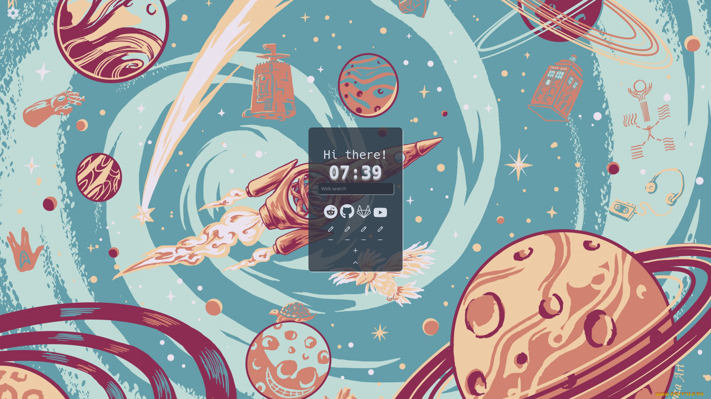
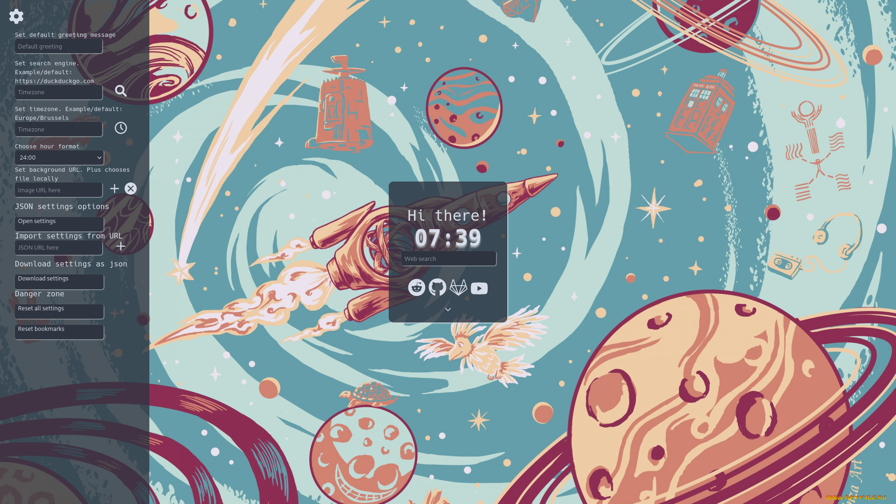

# Startpage - a cozy home page for web browsers

# Installation

Just set `https://travlesh.github.io/` as your firefox start page (Settings -> Home -> Homepage and new windows)

You can also use [new tab override](https://duckduckgo.com/?q=new+tab+override) to override new tabs with `localhost`

# Hosting page locally

For now install lighttpd

- for ubuntu/other debian derrivatives:

> sudo apt install lighttpd

- for arch derrivatives:

> sudo pacman -S lighttpd

And then:

> make

**If you have an init system that is different from systemd, do:**

> make config

**and then enable** `lighttpd` **manually**

Now just set `localhost` as your homepage

# Screenshots

